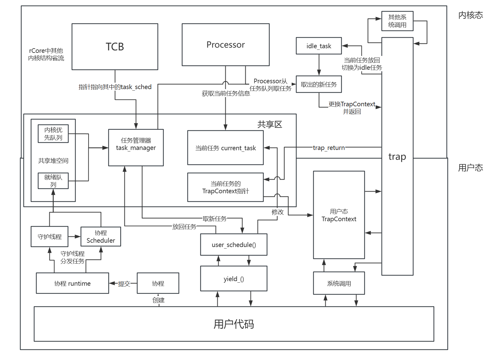

# 设计方案

**作者**：胡嘉晨、肖嘉骏  
**创建日期**：2025-06-28  
**最后更新**：2025-08-14  

## 1 设计思路

我们的题目是：支持优先级的Rust协程调度。要在协程实现中引入优先级，并支持基于协程优先级的进程、线程和协程统一调度。

总体而言，我们的思路是：在内核态，调度进程与线程；在用户态，调度线程与协程

### 1.1 内核态

内核态的调度沿用 rCore 中的设计，即 idle_task 作为陷入和返回的连接，其他线程在陷入内核切换时先切换到 idle_task，然后再由 processor 取下一个就绪线程执行。在 Trap 返回的过程中进行地址空间切换，从而在线程切换时间接的实现进程切换。

在此基础上，我们为线程加入了优先级，并将线程按照大根堆组织起来，以便于快速找到优先级最高的线程。当 processor 取线程时，队首的线程即为优先级最高的线程。

任务队列分为两个：就绪队列和内核优先队列。内核优先队列中存放会被阻塞或在内核中主动放弃 CPU 的任务，内核优先取这其中的任务；就绪队列存放其他状态为就绪的任务，用户态线程调度时从这里取任务，内核态线程调度时也可以从这中取出任务。

内核态的 TCB 被重新组织了，提取出其中涉及到线程调度的部分，并放入`TaskSched`结构体中，以便于在用户态进行调度。

### 1.2 用户态

用户态的调度分为两部分：线程调度和协程调度。

线程的调度与内核相似，只不过在切换的过程中不用再考虑陷入等与内核相关的事情。为了实现内核态与用户态的线程切换相统一，我们参考了 vdso 技术的思路，设置了内核态和用户态的共享区。我们将就绪线程队列放在了共享区中，使得用户态可以直接访问就绪队列，与内核态的线程队列和调度同步。在进行线程调时，沿用了 TrapContext 保存线程上下文，这样可以实现在不切换地址空间的前提下保存完整的上下文，同时内核态不影响调度。在共享区维护一个指针指向了当前任务的 TrapContext，在用调度时，通过修改该指针，可以实现线程的切换。

协程调度中，我们参考 tokio 的调度思路，为每个进程通过 lazy_static 的方式创建一个协程运行时 runtime，每个运行时中维护4个调度器 scheduler 线程，每个调度器维护一个协程队列，选择最高优先级的协程进行执行。同一进程的不同线程的协程会提交到同一个运行时中。

用户在提交协程时，需要设置其优先级，该优先级会被记录在协程的结构体中，并被放入相应的调度器的任务队列中。取当前线程提交的协程中优先级最高的协程的优先级作为该线程的调度优先级。

### 1.3 架构图

这种设计的优点是：为用户态提供一个较为完整的协程机制，并通过用户态线程调度提高协程运行的效率。本质上是协程调度器的切换通过线程切换实现，协程分发通过守护线程实现，用户态进行线程调度降低线程切换成本，内核态通过线程切换实现进程切换，达到进程、线程、协程的统一调度。

## 2 实现描述

### 2.1 协程实现

协程类 coroutine：基于`Future trait`实现，对每个协程分配`CID`，支持1-20级优先级。同时对协程实现比较的接口，方便在调度器中依据优先级和年龄进行协程的排序。

调度器 scheduler：基于`Future`和`Wait`机制实现，基于大根堆实现对其调度的每个协程进行管理与排序。调度器取出协程任务后，执行改协程的`poll`方法，如果执行结果为`Ready`，则更新当前的协程计数和最大优先级，并向上跟新线程优先级。如果执行结果为`Pending`，暂时不把它放回任务队列，等待其上下文的`Waker`调用`wake`后再将其放回。
> 这样做的好处是：只调度能立即执行的任务，减少无意义的 poll，提高高优先级任务的响应速度，同时在多处理器的情况下，能够降低调度器的锁竞争和队列操作开销。

默认4个工作线程，每个线程运行独立调度器，以支持多处理器的情况。

守护线程：用于将协程分配到调度器上，实现负载均衡。此外，还可以用守护线程实现定时器、信号处理等功能。
> 不过这不是本项目的重点，因此没有更多的实现。

协程同步：通过`Event`将实现协程同步。具体而言，`Event`中维护一个`Waker`对象，协程将自己运行代码中在该`Event`处等待，当其他协程调用改`Event`的`set`时，`Waker`对象将通知该协程并继续运行。

> 本质上讲，这种实现将`Event`也变为了一个协程，并通过调度器调度，在其他协程调用`set`时，`Event`的`Waker`对象将通知该协程并在调度器中直接运行，之后`Future`机制实现了再次`wake`前面的协程，从而实现协程同步。  
>>这样是否有些冗余？需要后续的进一步研究改进。

协程创建即运行的过程如下：

1. 用户通过`async`和`await`定义异步函数
2. 通过`submit_distribute_coroutine`提交协程到运行时的公共队列
3. 运行时的守护线程从公共队列取出协程，分配到调度器线程的等待队列上，队列按照优先级排序
4. 调度器线程从等待队列的队首取出任务，调用协程的`poll`，并维护其计数和最大优先级
5. 如果结果为`Ready`，则更新计数和最大优先级
6. 其他协程在`await`处被唤醒时，在`wake`中被提交到公共队列，等待守护线程分配
7. 重复步骤3-6，直到协程执行完毕
8. 协程的结果被返回给用户

### 2.2 用户态线程切换与共享区实现

由于我们的协程都在用户态执行，同时协程运行时的正常运行中涉及到多个线程的切换，因此实现用户态线程切换是有必要的。在rCore中，线程被设计为内核级线程，用户态是无法参与线程调度的，因此我们需要想办法在用户态对内核级线程进行调度。

为了实现用户态线程调度，以及与内核态的线程切换相统一，我们参考了 vdso 技术的思路，设置了内核态和用户态的共享区，在内核态与用户态共用一个调度器。

共享区在内核态和用户态的地址空间中都硬编码地址为`2^64 - 256GB + 1`，大小为 18 个页面大小。其中第一个页面存放共享数据`VDSO_DATA`，剩下的页面作为共享堆空间，其中存放线程的`TaskSched`结构体，用来保存线程调度的相关信息。

> 选择这个地址是因为在 RISC-V 64 架构中，启用 SV39 分页模式下，只有低 39 位是真正有意义的，高 25 位需要与第 38 位相同。在 rCore 的设计中，高 256G 的地址中页面是从高到低占用的，我们任务其几乎不可能占用全部的256G，较低地址位置一定是空闲的。因此选择这个地址不会对之前的设计造成影响。

共享区第一页的内容包括：

- task_manager：线程调度器，存储以下内容：
    - 线程队列：`[Arc<TaskSched, LockedHeapAllocator>; 128]`。这里的`LockedHeapAllocator`是一个堆分配器，将`TaskSched`对象分配在后16页的共享堆空间中，以便于线程调度时不会出现跨地址空间的问题。
    - 线程数量：usize。记录当前队列中线程的数量。不使用`AtomicUsize`是因为`AtomicUsize`在用户态调度时会先上锁，即下述的`block_sched`，防止被打断。
    - 空线程结构体，用来在排序时当作临时变量。
- current_task：其类型为`[Option<Arc<TaskSched, LockedHeapAllocator>>; PROCESSOR_NUM]`，用来保存当前各处理器正在处理的线程。
- block_sched: 其类型为`AtomicBool`，用来阻止用户态调度时被打断。当用户态在进行调度时，将其设置为`true`，此时内核的时钟中断将不再进行任务切换，防止用户态调度过程被打断后上下文错误保存。当用户态调度结束后，设置为`false`。

`TaskManager`实现了以下两个接口，方便内核态与用户态调度：
- `add()`：将线程加入线程队列，并按照大根堆组织顺序。
- `fetch()`：取出优先级最高的线程，并将剩下的任务按照大根堆组织顺序。

后 16 页内容为共享堆空间，用来存放线程的`TaskSched`结构体。这些结构体对象在线程创建时由内核初始化，并放入共享堆中。`TaskSched`记录线程调度时必须的上下文信息。

用户态线程调度的过程如下：

1. 用户态线程调用`yield_()`进入`user_schedule()`函数，开始用户态调度
2. `user_schedule()`函数取共享区数据，然后设置`block_sched`为`true`。然后从`current_task`中取出当前处理器运行的线程。如果取出失败则`panic!`
3. 判断就绪队列中最高优先级的线程是否与当前线程在一个地址空间，如果不是则先设置`block_sched`为`false`，再调用系统调用`sys_yield`由内核切换线程同时切换进程。
4. 调用`fetch()`，取出优先级最高的线程，修改当前线程和下一线程的状态，并通过汇编指令保存和加载线程上下文。
5. 修改`block_sched`为`false`，用户态线程调度结束。

此外，为了让此调度器在内核态也能进行调度，我们修改了 rCore 中的 TCB 等结构，以支持线程调度。

## 3 代码说明

### 3.1 内核态部分

添加模块：
- /os/src/vdso：共享区模块
    - /os/src/vdso/mod.rs：共享区模块声明
    - /os/src/vdso/vdso.rs：共享区模块实现，包括共享数据结构定义、初始化、共享堆空间分配器定义。

> 实际上这里并不是真正的 VDSO 技术，取这个名字仅是为了方便理解。

修改部分：
- /os/src/mm/memory_set.rs：新增共享区映射的函数与实现
- /os/src/task：
    - /os/src/task/task.rs：修改 TCB 结构，增加`TaskSched`字段，原 TCB 增加指针指向`TaskSched`
    - /os/src/task/manager.rs：修改`TaskManager`结构，适应用户态线程调度。
    - /os/src/task/processor.rs：修改`Processor`结构，将`current_task`结构删除，并相关函数需要的当前任务从共享区读取。
- /os/src/trap：
    - /os/src/trap/mod.rs：修改`trap_return`，增加读取当前任务的 Trap 上下文。
    - /os/src/trap/trap.S：修改汇编码，从共享区读取`TrapContext`指针并找到对应内容。

### 3.2 用户态部分

添加模块：
- /user/src/coroutine：协程模块
    - /user/src/coroutine/mod.rs：协程模块声明
    - /user/src/coroutine/scheduler.rs：协程调度器实现，包括调度器、协程队列、`Waker`等的实现，其中的`run()`是调度器的主循环。
    - /user/src/coroutine/runtime.rs：协程运行时实现，包括运行时、公共协程队列、调度器线程创建和回收、守护线程等。
    - /user/src/coroutine/coroutine.rs：协程实现，包括协程类定义、创建、比较、回收
    - /user/src/coroutine/event.rs：协程同步实现
- /user/src/coroutine_lib：协程库模块，包括两个个协程函数：`sleep_coro`和`yield_coro`
- /user/src/task_sched：用户态线程调度模块
    - /user/src/task_sched/mod.rs：用户态线程调度模块声明
    - /user/src/task_sched/manager.rs：用户态线程调度器实现，包括`TaskManager`结构体、线程添加、取出等。
    - /user/src/task_sched/task.rs：`TaskSched`结构体定义。
    - /user/src/task_sched/ticket_lock.rs：`TicketLock`结构体定义与函数实现。
    - /user/src/task_sched/trap.rs：`TrapContext`结构体定义
    - /user/src/task_sched/switch.S：汇编指令，用于保存和加载线程上下文。
    - /user/src/task_sched/vdos.rs：用户态线程调度函数`user_schedule()`，共享数据结构体定义、初始化等。
此外增加三个测试程序：
- /user/src/bin/coroutine_test：测试协程调度器的正确性
- /user/src/bin/coroutine_test_all：多线程协程调度测试，是最全面的测试
- /user/src/bin/coroutine_prior_test：测试协程优先级调度的正确性

修改部分：
- /user/src/task.rs：修改`yield_()`函数，将调用`sys_yield`改为调用`user_schedule`进行用户态线程调度。
此外修改测试程序：
- /user/src/bin/threads_arg：将每个线程每次打印后都主动`yield_()`，用来测试用户态线程调度。

## 4 开发过程遇到的问题：

### 4.1 协程调度器的开发

因为协程被设计成多个线程都可以向调度器中提交任务，这需要保证调度器线程安全，因此使用了`Mutex`锁。但因为协程结构中包括了当前调度器的弱引用，因此需要使用`Arc`包装，这就需要使用`Arc`锁。此时，对协程的操作很容易产生死锁，例如在向指定调度器提交任务时，提交者获得了调度器的锁，然后创建协程时又试图获取调度器的锁，这时就会产生死锁。

为了解决这个问题，我们把提交过程中，提交任务的队列变成了公共队列，即所有协程都提交到一个队列中，然后再由守护线程分发任务到各个调度器内。这样通过运行时管理所有协程队列更加简单，避免了死锁。

> 实际上在我们目前的代码中，协程对象中包括的调度器是无意义的，但是在设计之初在协程返回`Pending`时是由调度器再次加入队列的，那是是需要调度器对象的。现在保留这个调度器对象是为了方便之后再有扩展时可能会用到，后续再考虑是否去掉。

### 4.2 共享区报错 LoadPageError

在开发共享区时经常出现报错`LoadPageError`，原因是其次我们的共享区中使用的是`Arc`指针，而这个指针可能会指向共享区外的数据，导致在内核态可以正常运行，而在用户态尝试调度时会报错。

为了解决这个问题，我们扩大了共享区的页数，并分配处16页用来当作共享堆空间，把所有线程的`TaskSched`结构体都放在共享堆空间中，这样就可以保证在用户态调度时不会出现跨地址空间的问题。

### 4.3 用户态调度报错 Unsupported syscall

在初步实现了用户态调度时，进行调度测试发现报错`Unsupported syscall`，但是我们的测试代码并没有发起系统调用，并且也不应该进入`syscall`部分。初步判断原因是我们错误的把`TaskContext`中的`ra`当作是用户态返回的地址，而它实际上是内核态返回地址，例如`Trap_return`。

对此，我们额外的增加了`user_ra`字段，在进入内核前保存用户态返回地址，在`Trap_return`中恢复用户态返回地址。但测试发现，仍然不对，并且多了报错`StorePageError`的问题。进一步调试，我们发现问题出在了进入用户态调度代码`user_schedule`后，返回地址`ra`没有保存正确。

之后，我们将调用汇编函数`__switch_user`由`call`的方式转换成`jr`的方式，来防止`ra`被覆盖。但这样还是没有解决问题。

最后，我们发现调度的所有上下文应该全部保存，包括所有寄存器、用户栈等信息，而内核栈也应该同时转换，否则就会出现内核中地址不能正确返回。对此，我们选择直接使用`TrapContext`作为保存上下文的结构体，并修改`Trap_return`中恢复所有寄存器、用户栈等信息，然后在`user_schedule`中直接保存和加载上下文。最终解决了这个问题。

### 4.4 vs code 的 rust-analyzer 问题

rust-analyzer 的问题很多，经常出现加载项目时加载失败，导致代码编写时无法正常提供提示、跳转等功能。

对此，我们搜索了很多资料，最后在 rust-analyzer 的 Github 仓库中发现了相关 [Issue](https://github.com/rust-lang/rust-analyzer/issues/10910)，并解决了这个问题。

## 5 参考材料

我们的代码是在 rCore 的基础上进行开发的，开发中参考了以下内容：

- [rCore-Tutorial-v3](https://rcore-os.cn/rCore-Tutorial-Book-v3/index.html)
- [vdso_crate_template](https://github.com/rosy233333/vdso_crate_template)
